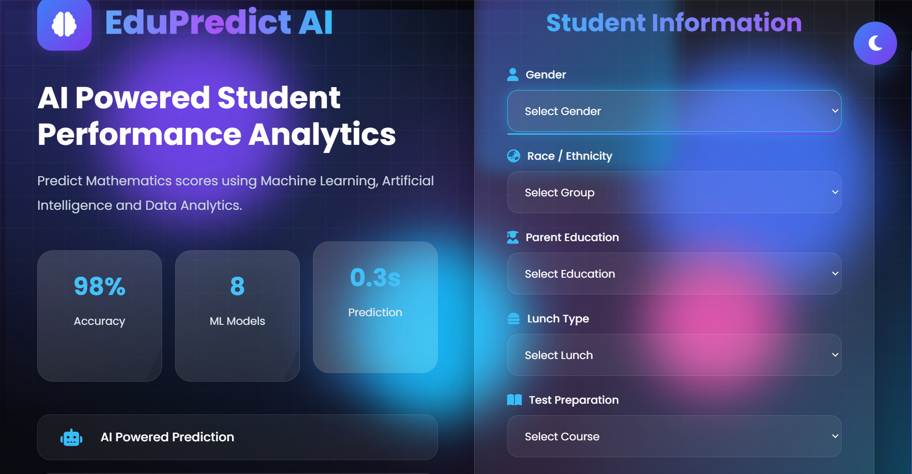
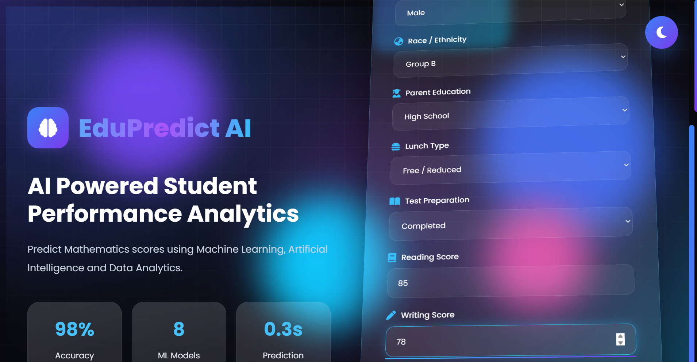
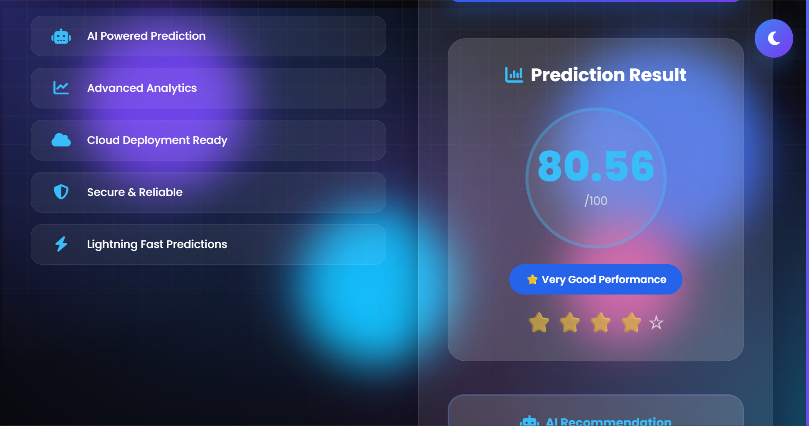

# 🎓 EduPredict-AI: Student Performance Prediction using Machine Learning

<p align="center">
  
</p>

<p align="center">


</p>

---

# 📖 Overview

**EduPredict-AI** is an **End-to-End Machine Learning** project that predicts a student's **Mathematics Score** based on demographic and academic attributes.

The project demonstrates the complete Machine Learning lifecycle—from **Exploratory Data Analysis (EDA)** and **Feature Engineering** to **Model Training**, **Model Selection**, and **Deployment** using **Flask**.

It follows a modular production-style architecture with separate components for data ingestion, transformation, training, prediction, logging, and exception handling.

---

# ⭐ Project Highlights

- 📊 End-to-End Machine Learning Pipeline
- 🤖 Multiple Regression Algorithms
- 🏆 Automatic Best Model Selection
- 🧹 Data Preprocessing & Feature Engineering
- ⚙️ Modular Project Architecture
- 📈 Real-Time Student Score Prediction
- 🌐 Flask Web Application
- 📝 Logging & Exception Handling
- 💾 Model Serialization using Pickle
- 🚀 Deployment Ready

---

# 🛠 Tech Stack

### Programming Language

- Python

### Machine Learning

- Scikit-Learn
- CatBoost
- XGBoost
- Pandas
- NumPy

### Web Framework

- Flask

### Frontend

- HTML
- CSS
- JavaScript

### Development Tools

- Git
- GitHub
- VS Code
- Jupyter Notebook

---

# 📂 Project Structure

```text
EduPredict-AI/
│
├── artifacts/
│   ├── data.csv
│   ├── train.csv
│   ├── test.csv
│   ├── model.pkl
│   └── preprocessor.pkl
│
├── notebook/
│   ├── EDA STUDENT PERFORMANCE.ipynb
│   └── MODEL TRAINING.ipynb
│
├── src/
│   ├── components/
│   │      data_ingestion.py
│   │      data_transformation.py
│   │      model_trainer.py
│   │
│   ├── pipeline/
│   │      train_pipeline.py
│   │      predict_pipeline.py
│   │
│   ├── logger.py
│   ├── exception.py
│   └── utils.py
│
├── static/
├── templates/
├── images/
│   ├── home.png
│   ├── prediction_form.png
│   └── result.png
│
├── app.py
├── application.py
├── requirements.txt
└── README.md
```

---

# ⚙ Machine Learning Workflow

```text
                    Student Dataset
                           │
                           ▼
                  Data Ingestion
                           │
                           ▼
                Data Transformation
                           │
                           ▼
                 Feature Engineering
                           │
                           ▼
               Multiple ML Algorithms
                           │
                           ▼
               Best Model Selection
                           │
                           ▼
              Save Model & Preprocessor
                           │
                           ▼
                 Prediction Pipeline
                           │
                           ▼
                 Flask Web Application
```

---

# 📊 Dataset Features

The prediction model uses the following features:

- Gender
- Race / Ethnicity
- Parental Level of Education
- Lunch Type
- Test Preparation Course
- Reading Score
- Writing Score

### 🎯 Target Variable

- Mathematics Score

---

# 📸 Application Screenshots

## 🏠 Home Page

The landing page provides an overview of the application and highlights the key features of the project.

<p align="center">

</p>

---

## 📝 Student Information Form

Users enter academic and demographic details required by the Machine Learning model.

<p align="center">

</p>

---

## 📈 Prediction Result

The trained model predicts the student's Mathematics score instantly and displays the result along with a performance indicator.

<p align="center">

</p>

---

# 🚀 Installation

Clone the repository

```bash
git clone https://github.com/Anujku007/EduPredict-AI.git
```

Move into the project directory

```bash
cd EduPredict-AI
```

Create a virtual environment

```bash
python -m venv venv
```

Activate the virtual environment

### Windows

```bash
venv\Scripts\activate
```

### Linux / macOS

```bash
source venv/bin/activate
```

Install the required dependencies

```bash
pip install -r requirements.txt
```

Run the application

```bash
python app.py
```

Open your browser

```
http://127.0.0.1:5000
```

---

# 💻 How It Works

```text
Student Information
          │
          ▼
Flask Web Application
          │
          ▼
Prediction Pipeline
          │
          ▼
Data Preprocessing
          │
          ▼
Trained Machine Learning Model
          │
          ▼
Predicted Mathematics Score
```

---

# 💡 Skills Demonstrated

- Machine Learning
- Regression Analysis
- Data Preprocessing
- Feature Engineering
- Model Evaluation
- Flask Deployment
- Object-Oriented Programming
- Logging & Exception Handling
- Production-Level ML Pipeline
- Software Engineering Best Practices

---

# 📚 Key Learnings

During this project I gained practical experience in:

- Building production-ready Machine Learning pipelines
- Data preprocessing and feature engineering
- Comparing multiple regression algorithms
- Selecting the best-performing model
- Model serialization using Pickle
- Flask application development
- Modular project architecture
- Logging and exception handling
- Deploying Machine Learning applications

---

# 🚀 Future Improvements

- Docker Containerization
- GitHub Actions CI/CD
- FastAPI REST API
- AWS Deployment
- Azure Deployment
- User Authentication
- Database Integration
- Model Monitoring
- Performance Dashboard

---

# 🤝 Contributing

Contributions are welcome!

If you would like to improve this project:

1. Fork the repository.
2. Create a new feature branch.
3. Commit your changes.
4. Push the branch.
5. Open a Pull Request.

---

# 👨‍💻 Author

**Anuj Yadav**

📧 Feel free to connect and explore more of my projects.

**GitHub:** https://github.com/Anujku007

---

# ⭐ Support

If you found this project useful, please consider giving it a **⭐ Star** on GitHub.

It helps support the project and motivates future development.

---

# 📜 License

This project is licensed under the **MIT License**.

---

<p align="center">
Made with ❤️ using Python, Scikit-Learn and Flask
</p>